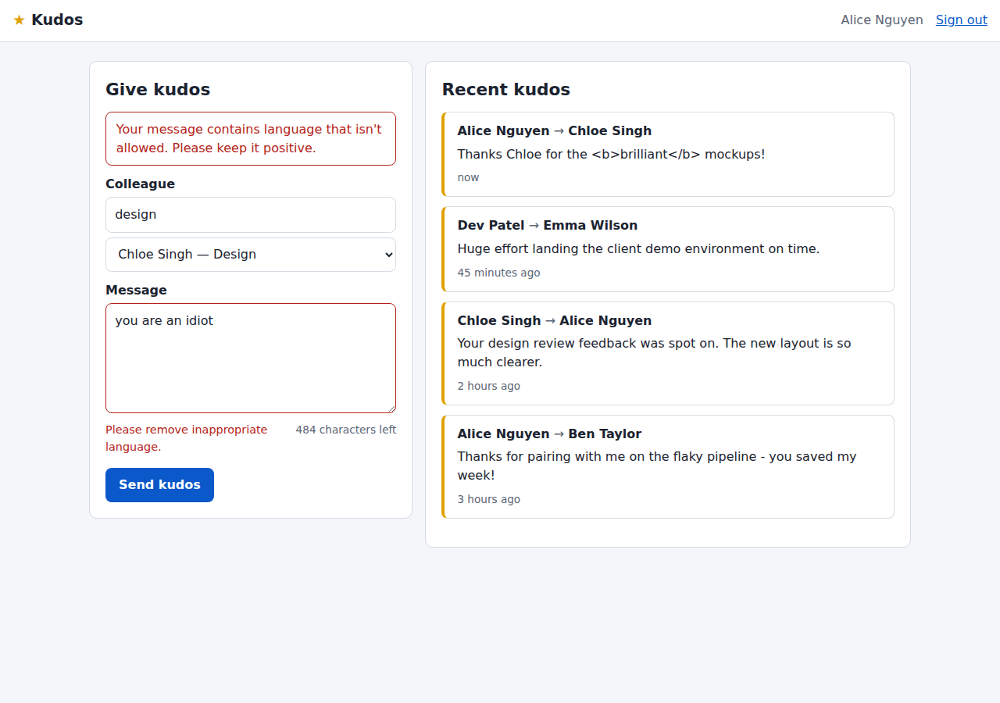
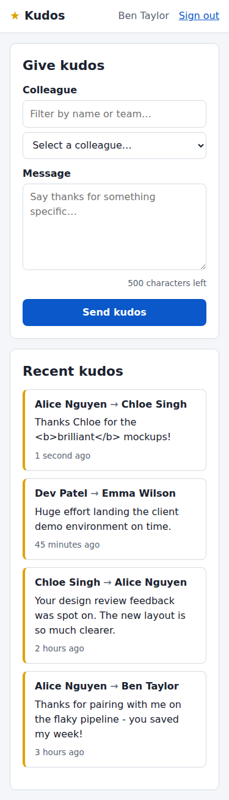
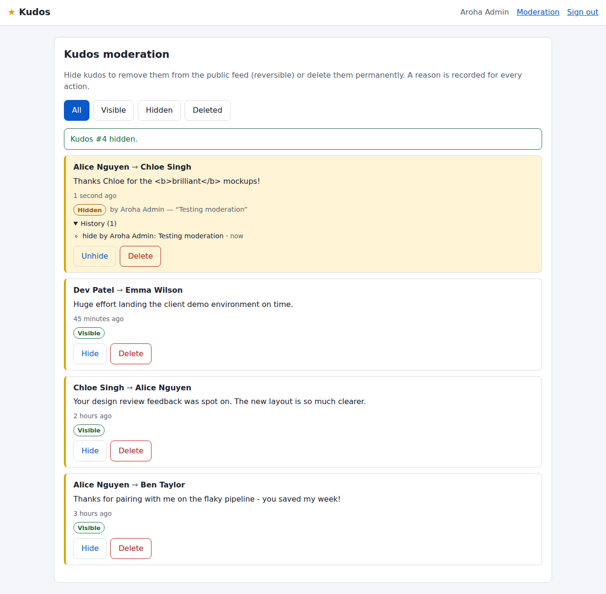

# Kudos: peer appreciation for the employee portal

Built spec-first from [`../SPECIFICATION.md`](../SPECIFICATION.md). The spec is the source of truth for requirements, design and the implementation plan.

| Dashboard (desktop) | Dashboard (mobile) | Admin moderation |
|---|---|---|
|  |  |  |

## Features

- Give kudos: pick a colleague from a searchable list, write up to 500 characters, and submit.
- Public dashboard feed of visible kudos, newest first, with "Load more" pagination.
- Admin moderation: hide or unhide, and soft delete. Each action requires a reason and is recorded in an audit history.
- Abuse prevention: blocked-terms filter, duplicate detection (24 h) and a rate limit (10 per hour).
- Security: session auth, role checks on every request, CSRF tokens, CSP and security headers, parameterised SQL, and XSS-safe rendering.
- Responsive, accessible UI with no build step (vanilla JS and CSS).

## Run locally

```bash
cd kudos
python3 -m venv .venv && source .venv/bin/activate
pip install -r requirements.txt
flask --app app init-db      # creates instance/kudos.sqlite3 with demo data
flask --app app run          # http://127.0.0.1:5000
```

Demo accounts all use the password `password123`:

| Email | Role |
|---|---|
| `admin@datacom.example` | admin (sees **Moderation**) |
| `alice@datacom.example`, `ben@…`, `chloe@…`, `dev@…`, `emma@…` | user |

## Test

```bash
cd kudos
pytest -q
```

48 tests cover the validation rules (V-1 to V-9), authentication and CSRF, the feed and pagination, XSS handling, and the moderation state machine and audit log.

## Configuration

| Env var | Default | Purpose |
|---|---|---|
| `KUDOS_SECRET_KEY` | dev key | Session signing key. **Required** when `KUDOS_ENV=production`. |
| `KUDOS_ENV` | `development` | `production` enables secure cookies and the secret-key check. |
| `KUDOS_DATABASE` | `instance/kudos.sqlite3` | SQLite file path. |
| `KUDOS_RATE_LIMIT` / `KUDOS_RATE_WINDOW_MINUTES` | `10` / `60` | Spam limit per sender. |
| `KUDOS_DUPLICATE_WINDOW_HOURS` | `24` | Duplicate-detection window. |
| `KUDOS_BLOCKED_TERMS` | small default list | Comma-separated blocked words. |

Production: `gunicorn "app:create_app()"` behind the portal's reverse proxy. See spec §4.2.

## Layout

```
kudos/
├── app/
│   ├── __init__.py   app factory, error handlers
│   ├── config.py     settings and business-rule limits
│   ├── db.py         SQLite connection, init-db, seed data
│   ├── schema.sql    tables and indexes (spec §3.2)
│   ├── auth.py       login/logout, role decorators, CSRF, security headers
│   ├── services.py   validation, anti-abuse, feed queries, moderation
│   ├── api.py        JSON REST API (spec §3.3)
│   ├── views.py      pages
│   ├── templates/    base, login, dashboard, admin, error
│   └── static/       styles.css, common.js, dashboard.js, admin.js
└── tests/            pytest suite
```
